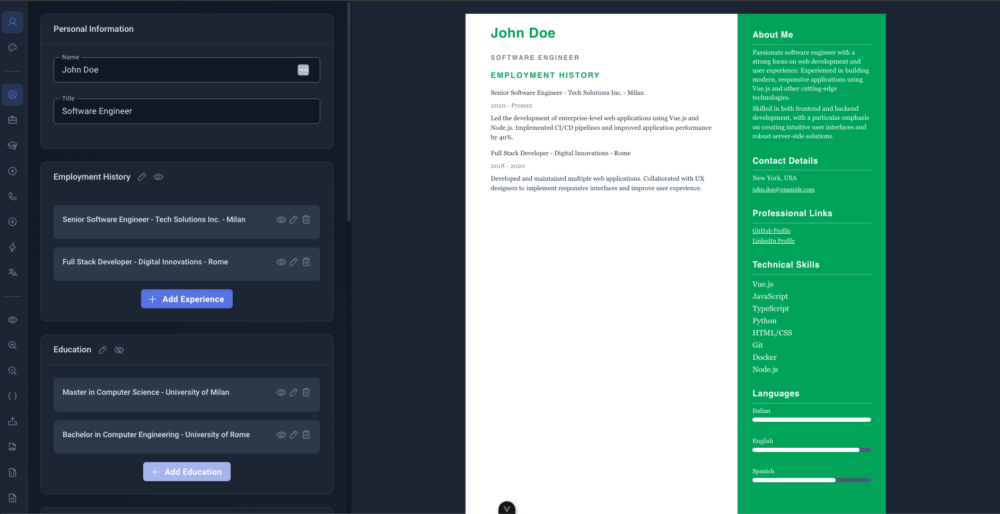

# Resume Builder

A modern, single-page resume builder application built with Vue 3 and Vuetify. Create professional resumes with a beautiful UI and export them as HTML, PDF or JSON.

## Disclaimer

*This project is a work in progress and is provided "as is" without any warranties or guarantees. The developers are not responsible for any issues or damages that may arise from using this software. This application is developed using AI for code generation, embracing a "vibe coding" approach to enhance speed and efficiency. Users are encouraged to contribute to the project and report any bugs or issues they encounter. Please use this application at your own risk.*


## Features



- 🎨 **Modern UI**: Clean and intuitive interface built with Vuetify 3
- 📝 **Real-time Preview**: See your changes instantly with live preview
- 🔄 **Dynamic Sections**: Add, remove, and reorder sections as needed
- 🎯 **Customizable Details**: Flexible detail fields with link support
- 🎭 **Style Customization**: Customize colors, typography, and layout
- 💾 **Multiple Export Formats**: Download as HTML, PDF, JSON or TXT (plain text)
- 🔒 **Privacy First**: Everything stays in your browser
- 💾 **Save/Load**: Import and export your resume data as JSON
- 🤖 **AI CV Conversion**: Convert existing CVs using AI models
- 🔍 **Zoom Controls**: Zoom in/out for better editing experience
- 📱 **Mobile Responsive**: Works seamlessly on desktop and mobile devices
- 🎯 **Section Navigation**: Quick navigation between resume sections
- 📚 **CV Writing Guide**: Access to comprehensive CV writing resources

## Getting Started

### Prerequisites

- Node.js (v16 or higher) and npm/yarn, OR
- Docker and Docker Compose (v2.22.0 or later)

### Installation

#### Option 1: Local Development

1. Clone the repository:
   ```bash
   git clone https://github.com/gianfrancodemarco/resume-builder.git
   cd resume-builder
   ```

2. Install dependencies:
   ```bash
   npm install
   # or
   yarn install
   ```

3. Start the development server:
   ```bash
   npm run dev
   # or
   yarn dev
   ```

4. Open your browser and navigate to `http://localhost:5173`

#### Option 2: Docker Development (Recommended)

1. Clone the repository:
   ```bash
   git clone https://github.com/gianfrancodemarco/resume-builder.git
   cd resume-builder
   ```

2. Start with Docker Compose Watch:
   ```bash
   docker compose up --build --watch
   ```

3. Open your browser and navigate to `http://localhost:5173`

## Technologies Used

- [Vue 3](https://vuejs.org/) - Progressive JavaScript framework
- [Vuetify 3](https://vuetifyjs.com/) - Material Design component framework
- [TipTap](https://tiptap.dev/) - Rich text editor
- [Phosphor Icons](https://phosphoricons.com/) - Icon library
- [Docker](https://www.docker.com/) - Containerization platform
- [Docker Compose](https://docs.docker.com/compose/) - File watching and hot reload

## License

This project is licensed under the MIT License - see the [LICENSE](LICENSE) file for details.

## Acknowledgments

- Icons by [Phosphor Icons](https://phosphoricons.com/)
- CV Writing Guide by [Guido Penta](https://github.com/GuidoPenta/galactic-CV-guide-for-developers)
- Inspiration from modern resume templates
